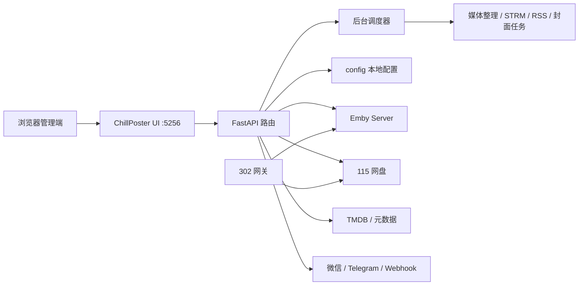

# ChillPoster Wiki

欢迎来到 ChillPoster Wiki。这里面向正在部署、配置、运维和二次开发 ChillPoster 的用户，目标是把“能跑起来”升级为“跑得稳定、看得明白、方便排障”。

## 推荐阅读顺序

1. [安装部署](installation.md)
2. [核心配置](configuration.md)
3. [功能指南](features.md)
4. [运维手册](operations.md)
5. [发布流程](release.md)

## ChillPoster 是什么

ChillPoster 是一个以 Emby 为中心、深度适配 115 网盘使用场景的影音自动化管理系统。它通过一个统一 Web UI 管理：

- Emby 服务器与封面任务
- 115 账号、302 网关与网盘资源
- 资源转存、媒体整理、STRM 同步
- RSS 真实库、独立真实库、缺集统计
- MoviePilot、HDHive、Webhook、微信与 Telegram 联动
- Docker 运维、系统健康、升级与计划任务

## 适合谁

- 已经使用 Emby，并希望统一管理封面、媒体库和后台任务的用户。
- 使用 115 网盘保存影视资源，希望降低本地存储占用的 NAS 用户。
- 希望把转存、整理、入库、刷新、通知连成稳定自动化流程的用户。
- 需要同时管理多个 Emby、多个网关端口或多类媒体库规则的进阶用户。

## 基础架构



## 目录地图

```text
main.py                 主入口，启动 UI 与网关服务
app/routers/            API 路由层
app/services/           任务、网盘、通知、整理等服务逻辑
core/                   Emby、TMDB、媒体识别、整理与通用工具
frontend/               Vue/Vite 管理端源码
static/                 旧版静态资源与运行时兜底目录
config/                 本地运行配置与日志，通常不提交 Git
fonts/                  封面字体资源
templates/              封面模板资源
layouts/                布局资源
defaults/               Docker 启动时用于恢复默认资源的副本
scripts/                部署与辅助脚本
```

## 常见工作流

### 一条龙入库

资源发现或手动转存后，ChillPoster 监听 115 目录变化，触发媒体整理、二级分类、重命名、STRM 同步与 Emby 刷新，并通过通知渠道反馈结果。

### 封面生产

选择 Emby 媒体库，配置字体和模板，生成封面预览后批量应用。应用前可创建备份套件，后续可以按媒体库恢复。

### 缺集补齐

缺集统计读取本地媒体库与 TMDB 信息，帮助确认缺失季集；可跳转资源搜索或 MoviePilot 订阅，形成补齐闭环。

### 长期运维

通过系统健康、Docker 管理、Emby 任务中心、后台任务进度与日志，持续观察服务状态。发布时通过 Git tag 触发镜像构建。

## 文档维护原则

- 文档描述应以代码中已存在的能力为准。
- 配置项涉及账号、Cookie、Token、API Key 时，只写用途和路径，不写真实值。
- 新增功能时同步更新 [功能指南](features.md) 与相关配置页。
- 发布流程变更时同步更新 [发布流程](release.md)。
